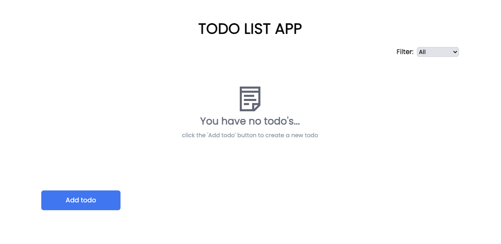
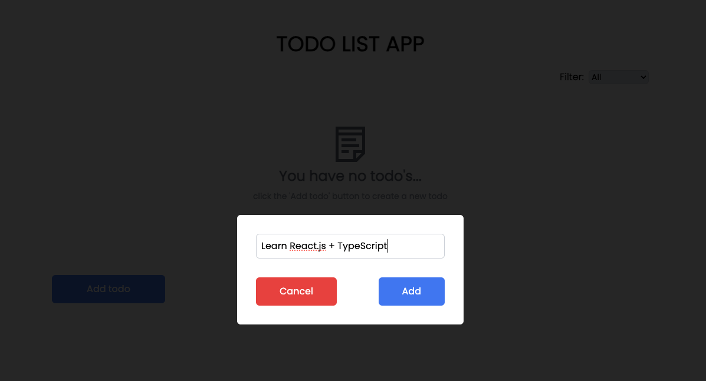
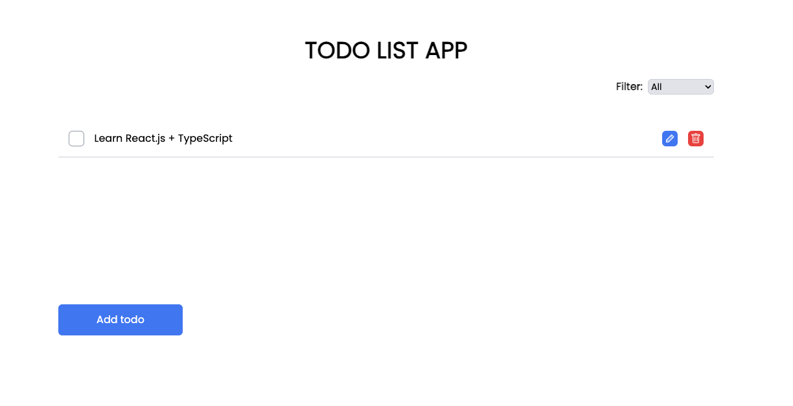
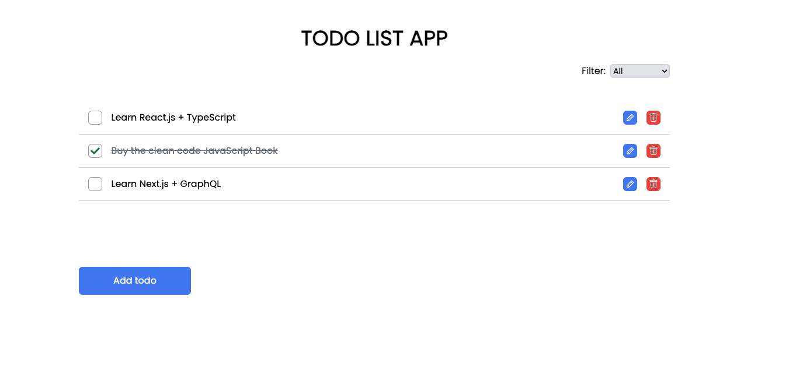

<div align="center" style="margin-bottom: 20px;">
  <div>
    <h1>TODO APP</h1>
  </div>

  <div align="center">
    
    
     
    
    
  </div>
</div>

## :memo: About project

This project is a task notes application, it is possible to create tasks, mark when completed, delete and edit, it was developed with React.js, state management is done with Redux, and all its styling was done with Tailwindcss.

## :cyclone: Run this project

```bash

# clone this repository
git clone https://github.com/jefferson1104/todo-app

# go to the folder
cd todo app

# install dependencies
npm install

# run the app
npm run dev
```

## 🎨 Screenshots

<div>
    
    
    
    
</div>
